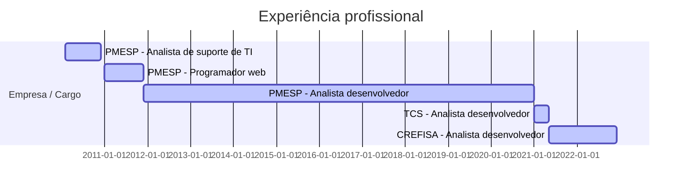

## Paulo Ferreira

 
 
Analista desenvolvedor com mais de dez anos de experiência na área de tecnologia da informação, atuando em projetos de grande porte e de alta complexidade.

 

<b>Perfil</b> 

Técnico analítico, adaptativo e com expertise em realizar ciclos completos dos processos de desenvolvimento de software.
Vivência com requisitos, arquitetura, desenvolvimento, integração de sistemas, liderança e treinamento, em times de alta performance e com foco na solução de problemas.

 

 
<b>Formação acadêmica</b>

* Pós-graduação (especialização) em Ciência de Dados e Big Data, pela PUC-MG - Pontifícia Universidade Católica de Minas Gerais (2022);

* Pós-graduação (especialização) em Gestão de Projetos de Software, pelo IFSP - Instituto Federal de Educação Ciência e Tecnologia de São Paulo (2015);

* Pós-graduação (especialização) em Planejamento, Implementação e Gestão de Ensino, pelo IME-UFF - Instituto de Matemática e Estatística da Universidade Federal Fluminense (2017);

* Graduação (Bacharelado) em Ciência da Computação, pela Universidade Guarulhos (2010).

 

 

__Banco Crefisa S.A.__
* Analista desenvolvedor | Full Stack Developer 
mai de 2021 - o momento 
Matriz SP 
Arquitetura | Análise | Desenvolvimento

 

__TCS - Tata Consultancy Services__
* Analista desenvolvedor | Full Stack Developer 
Porto Seguro - Matriz SP 
jan de 2021 - mai de 2021 · 5 meses 
Análise | Desenvolvimento

* Analista desenvolvedor | Full Stack Developer 
Itaú Saúde 
jan de 2021 - mai de 2021 · 5 meses 
Análise | Desenvolvimento

 

__Polícia Militar do Estado de São Paulo__
* Analista desenvolvedor .NET 
dez de 2011 - jan de 2021 · 9 anos 2 meses 
PMESP - Diretoria de pessoal 
Arquitetura | Análise | Desenvolvimento

* Programador web 
jan de 2011 - dez de 2011 · 1 anos 
PMESP - Centro de Apoio Social 
Desenvolvimento e sustentação de sistemas

* Analista de suporte de TI 
fev de 2010 - dez de 2010 · 11 meses 
PMESP - TelemáticaPMESP - Telemática 
Suporte técnico de TI

 

__Competências :__ Arquitetura, Análise, Requisitos, Desenvolvimento, Sustentação, Gestão de projetos, Agile, Análise de dados, Integração de sistemas, Liderança e Treinamento 

__Tecnologias :__ 

  
   

 

__Redes e contatos :__

 

 
 